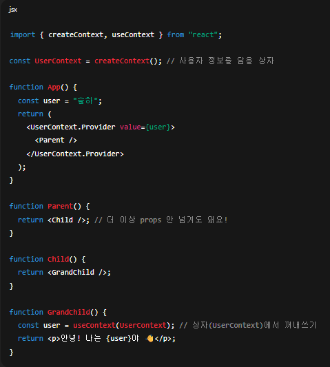
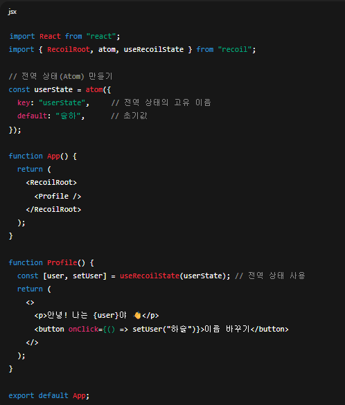
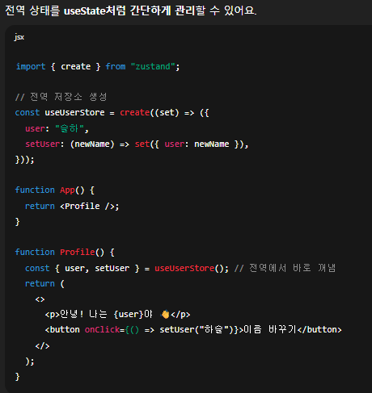

# Props Drilling
- 부모 → 자식 → 손자…처럼 깊게 중첩된 컴포넌트 트리에서 “필요한 하위 컴포넌트”까지 값을 전달하려고, 중간 컴포넌트들이 억지로 props를 받아 또 내려주는 현상.

## Props Drilling을 해결하기 위한 방법
### ContextAPI(React 내장) 
- 언제? 전역 테마, 로그인 사용자, 로케일 등 앱 전반에서 공유되는 값이 소수일 때.
- 장점: 외부 라이브러리 없음, 타입스크립트 궁합 양호.
- 단점: 큰 전역 상태(여러 조각/파생값)엔 관리가 번거롭고, Provider 중첩/리렌더 튜닝이 필요.


### Recoil
- 언제? 전역 상태가 여러 조각으로 흩어져 있고, 서로 파생값/의존성(selector)이 많은 경우.
- 장점: 원자 단위(atom) 관리로 필요한 곳만 리렌더, selector로 파생 상태 깔끔, 비동기 selector 편함.
- 단점: 러닝커브 약간, 생태계(미들웨어 등)는 Redux보단 작음.



### Zustand
- 언제? 전역 상태를 간단한 스토어로 빠르게 쓰고 싶을 때. 보일러플레이트 최소화, 직관적 사용.
- 장점: 아주 간단한 API, 부분 구독으로 리렌더 최소화, 미들웨어(퍼시스트/디브툴)도 깔끔.
- 단점: 파생 상태/의존 그래프는 Recoil만큼 자동화되지 않음(직접 셀렉터 작성).


---
## React Form 처리
- HTML / CSS 수업 할 때 오렌지가 어쩌고 하면서 form 처리와 관련된 부분을 다뤘음. React에서는 약간 차이가 있는데, HTML 양식은 제출되면(submit이 이루어지면), 다음 페이지로 이동함. React에서는 제출 후 폼 데이터에 접근할 수 있는 JS 함수를 호출하고 다음 페이지로의 이동을 방지하고 싶은 경우가 흔히 있음(Single Page Application이니까). 
.preventDefault()를 이용하여 제출 자체를 피하는 방법을 어제 마지막으로 다뤘음.

1. App.jsx에 MyForm만 배치시키시오.
2. input 하나와 button 하나가 있는 최소한의 폼 생성, 입력한 field의 값 가져오기 위해 onChange 이벤트 핸들러 사용
3. useState() 훅 활용, text라는 상태 변수 하나 생성. 그래서 input 필드의 값이 변경되면 새 값이 상태에 _갱신_ 될 수 있도록 작성.
4. 이 MyForm 컴포넌트는 폼 데이터가 리액트에 의해 처리되기 때문에 _제어 컴포넌트_ 라고 불림.

제어되지 않는 컴포넌트에서 폼 데이터는 DOM에 의해서만 처리될 것.

setText(event.target.value); 문을 통해 input field에서 값을 가져와서 상태에 저장하고, 제출 버튼을 눌렀을 때 입력한 값을, alert로 띄울 것.
이하는 예시
```jsx
import { useState } from "react";

function MyForm2() {
  const [text, setText] = useState('');

  // input field에 입력한 것을 submit하면 날려보낼 수 있도록 하는 함수 작성
  const handleChange = (event) => {
    setText(event.target.value);
    console.log(text);
  }

  const handleSubmit = (event) => {
    alert(`'${text}' 라고 입력하셨습니다.`);
    event.preventDefault();
  }

  return(
  <form onSubmit={handleSubmit}>
    <input type="text" onChange={handleChange} value={text}/>
    <br />
    <br />
    <input type="submit" value='클릭하세요' />
  </form>
  );
}

export default MyForm2;
```
이상에서 어제 내용과 헷갈릴 수 있는데, 상태가 업데이트된다고 해서 매번 리렌더링이 일어나는 것은 아님.
상태의 변화를 감지하여 리렌더링을 일으키기 위한 Hook은 useEffect()였음.


## React Developer Tools 확인하는 법
f12 눌러서 Components로 들어가보면 현재 작성한 코드 상에서의 Hook들을 확인할 수 있음.
MyForm을 기준으로 했을 때 text라는 상태 하나 밖에 없기 때문에

hooks
1. State : "안녕하세요"
를 확인할 수 있었음.

그러면 다수의 상태를 확인하는 부분을 체크하도록
1. MyForm3.jsx 생성 -> 초기화
2. App.jsx에 MyForm3 import

근데 우리가 todolist 때문에 하나자리 input으로 작성해서 그렇지 대부분의 경우 입력 form에는 입력 field가 복수로 이루어져있음. 그러면 각의 상태를 선언하는 방법도 있겠지만, 객체를 이용하여 처리하는 방법도 있을 것. MyForm3에서 검증.
이하는 예시

.preventDefault() -> SPA이기 때문에(html이 하나 이기 때문에) 다른 페이지로 넘어가는 것을 방지 

setUser({...user, [event.target.name]: event.target.value})
- setUser안에 {} -> 전체가 js 객체 (안에 콤마는 안에 키:밸류 쌍 구분)
- ...user -> spread 연산자, 객체 아님, 내부 element 타입 따라 타입 결
- [event.target.name]: event.target.value -> js property 키:밸류 쌍

```jsx
function MyForm3() {

  const [user, setUser] = useState({
    firstName: '',
    lastName: '',
    email: ''
  });

  // form에서 쓸거라 handleSubmit부터 작성
  const handleSubmit = (event) => {
    alert(`Hello, ${user.firstName} ${user.lastName}`);
    event.preventDefault();
  }

  // form 태그 썼고 내부에 input창으로 입력 받을거니까 onChange를 작성하게 될 것
  // 근데 여러 개의 input 태그 내에 onChange={event => setUser(event.target.value)}를 field 개수대로 쓸 필요는 없을 것 같으니까
  const handleChange = (event) => {
    setUser({...user, [event.target.name]: event.target.value})
  }

  return(
  <form onSubmit={handleSubmit}>
    <label>First Name : </label>
    <input type="text" name="firstName" onChange={handleChange} value={user.firstName} />
    <br /><br />

    <label>Last Name : </label>
    <input type="text" name="lastName" onChange={handleChange} value={user.lastName} />
    <br /><br />

    <label>Email : </label>
    <input type="text" name="email" onChange={handleChange} value={user.email} />
    <br /><br />
    
    <input type="submit" value="submit"/>
  </form>
  );
}

export default MyForm3;
```
JS 객체에서 특정 value를 참조하는 방법
1. 객체명.키
  - person.firstName
2. 객체명['키']
  - person['firstName'] => [event.target.name] 위의 예시에서 이 부분

자 그러면 lastName과 email에 대한 부분 완성, 맨 마지막에 input type='text'까지 적용해서 input 창에 firstName / lastName 입력 후에 제출 버튼을 눌러 alert 띄우시오.

### 과제

1. MyForm4.jsx 생성
2. App3.jsx 만들어서 기존 부분 복사해놓고, App.jsx 초기화 한 다음, MyForm4만 import
3. MyForm3를 참조하는데, 상태를 각각 선언하고, MyForm3와 동일하게 기능할 수 있도록 코드 작성.

# TypeScript
- TypeScript는 Microsoft에서 개발한, 타입 시스템을 제공하는 JS 상위 집합에 해당함.
최근에 인기가 늘어나고 있는 중이고, 22년 기준으로 가장 빠르게 성장하는 프로그래밍 언어로 선정됨.

- 특징
1. 변수, 함수, 클래스에 대한 _자료형_ 을 정의할 수 있다. 이를 통해 개발 프로세스 초기에 오류를 포착하는 것이 가능.
- 앱의 확장성을 향상시킬 수도 있고, 코드를 더 쉽게 유지 관리할 수 있게 해줌.
3. 코드 가독성이 향상되고 코드 자체 문서화가 더 쉽다.

타입스크립트 작성용 웹 IDE 사이트 : https://www.typescriptlang.org/play

## 공통 타입
- TS는 변수를 초기화할 때 변수의 타입을 자동으로 정의하는데, 이를 _타입 추론_ 이라고 함.

```ts
let message = '안녕하세요';
// string 자료형이라고 ts가 타입추론을 함.
message = 1;
```
message에 string 값을 대입했을 때, ts는 해당 변수의 자료형이 string이라고 알아서 타입 추론을 함. 그런데 다음 줄에서 message 변수에 number 자료형을 대입하니까 오류 메시지가 뜸(JS에서는 상관없음).

TS의 기본 타입은 JS와 동일함.
1. string : 문자열
2. number : 숫자
3. boolean: boolean

그런데 TS가 매번 암시적으로 타입 추론을 하게끔 하는 것이 아니라, 명시적 타입 설정을 하는 것도 가능.
- 명시적 타입 설정 방법
```ts
let email: string;
email = 3;
// 이상에서의 주목해야 할 점은 email이 number 자료형으로 초기화가 
// 됐음에도 불구하고 오류가 떴다는 점.

let age: number;
let isActive: boolean;

email = 'a@test.com';
age = 1;
// 변수의 자료형 확인
console.log(typeof email); // ressult : "string"
console.log(typeof age === 'string'); // reuslt : false
```
그런데, 변수의 타입을 모르는 경우도 있을 수 있음. 예를 들어서 외부 소스로부터 값을 받아올 때는 명확한 자료형을 모를 수도 있음.
```ts
let externalValue: unknown;
```
* 참조 : TS에서는 any라는 자료형도 존재함. any 타입을 이용하여 변수를 정의하는 경우는 TS가 해당 변수에 대해 타입 검사 또는 추론을 아예 하지 않음(즉, 기존의 JS처럼 사용이 가능함).
근데 이건 TS 사용하지 않겠다고 하는 거랑 다를 바가 없다보니까 가능한 any 안쓰는 것 추천.

- 배열 Array : JS에서와 동일한 방식으로 선언할 수 있기는 한데, 배열의 element들이 자료형을 정의해야 함.
```ts
let arrayOfNums: number[] = [1,2,3,4,5];
let animals: string[] = ['Dog', 'Cat', 'Tiger'];

// 제네릭 타입을 사용하는 방법
let arrayOfNums2: Array<number> = [9, 8, 7, 6];
let animals2: Array<string> = ['개', '고양이', '호랑이'];
```

- 또한 객체Object에서도 각각의 property에 대해 타입 추론을 자기가 알아서 함.
```ts
const student = {
  id: 1,
  name: '김일',
  email: 'kim1@test.com';
}
```
라고 했을 때, student.id의 자료형은 number, student.name / student.email의 자료형은 string이라고 알아서 추론함.

그런데 이 부분도 미리 통제 하고 싶다면, interface / type 키워드를 활용하여 객체 내부의 property의 자료형을 명시하는 것이 가능함.
```ts
//interface 이용 사례
interface Student {
    id: number;
    name: string;
    email: string;
};
// 이거 또 JS처럼 생겼기 때문에 (,) 써서 오류 내는 사람이 많음.
// type 이용 사례
type Student2 = {
    id: number;
    name: string;
    email: string;
};
// 이상과 같이 Student에 대한 속성에 대한 자료형이 있다고 가정했을 때,
// 이를 다 모아둔 Student를 자료형으로 또 쓸 수 있음.
const myStudent: Student = {
    id: 1,
    name: '김일',
    email: 'kim1@test.com'
};
// id: '1', 로 쓰면 오류 발생
```
그리고 Java에서의 와일드 카드에 해당하는 `?`도 있음. 선택적 속성을 정의할 수 있는데, 이는 일종의 생성자 부분과 관련이 있다고 볼 수 있음.
```ts
interface Student {
    id: number;
    name: string;
    email?: string;
};

const myStudent: Student = {
    id: 1,
    name: '김일'
};

console.log(myStudent.email); // result : undefined
```
- 선택적 체이닝 연산자(?.)를 이용하면 오류를 일으키지 않고 null이거나
undefined일 수 있는 객체 속성 및 메서드에 안전하게 접근이 가능.

```ts
type Person = {
  name: string;
  email: string;
  address?: {
    street: string;
    city: string;
  }
}

// 객체 생성
const person: Person = {
    name: '김이',
    email: 'kim2@test.com'
}
console.log(person);

// 그러면 오류가 생기는 부분
console.log(person.address.street);
// 그러면 선택적 체이닝을 통해 오류 발생 자체를 억제할 수 있음.
console.log(person.address?.street);
```
이상의 결과값으로는 undefined가 출력되고, 오류 발생 x.

그럼 이상까지의 상황에서 TS를 적용했을 때의 이점은 기본적으로 JS 상에서는 _실행을 시키고 나서야 오류 유무를 확인_ 할 수 있는 반면, TS 상에서는 개발단계에서(즉, 테스트/실전 데이터 입력 이전 단계에서) 예측 가능한 오류를 발생시키지 않을 수 있다는 것.

- 연산자를 이용한 서로 다른 타입을 병렬로 명시하는 방법
```ts
type InputType = string | number;
// 정의한 타입을 이용
let name: InputType = 'Hello';
let age: InputType = 12;
```
```ts
type Fuel = 'disel' | 'gasoline' | 'electric';
type NoOfGears = 5 | 6 | 7;
type Car = {
    brand: string;
    fuel: Fuel;
    gears: NoOfGears;
};

const car1: Car = {
    brand: '기아',
    fuel: 'disel',
    gears: 5
}

const car2: Car = {
    brand: '기아',
    fuel: 'disell', // 오타가 나거나 Fuel 내에 있는 string data를 벗어나면 오류
    gears: 8 // 다른 숫자가 들어가도 오류
}
```
이상의 예시는 연산자를 이용하여 _서로 다른 타입을 처리하는 타입_ 인 유니언 타입(Union Type)을 만드는 것이 가능함.

첫 번째 예시의 경우에는 string 이거나 number일 수 있는 InputType이라는 유니언 타입을 생성했고, 
두 번째 예시는 특정 string data(disel, gasoline, electirc)이거나 특정 number data(5,6,7)만을 가질 수 있는 유니언 타입인 Fuel / NoOfGears를 생성했음.

일종의 사용자 정의 type이라고 볼 수 있음. Java에서 class를 정의했던 것처럼.

## 함수
```ts
function sayHello(name: string) {
  console.log('hello ' + name);
}

//근데 name이 꼭 string이어야만 하냐 혹시 number를 넣어도 되게 하려면
function sayHello1(name: string | number) { // or 연산자 사용
  console.log('hello ' + name);
}

sayHello1(1);
sayHello1('김일');
```
이상의 경우에서는 매개변수의 자료형을 고정시키거나 혹은 복수의 자료형 중에 하나를 선택할 수 있게끔 통제하는 방안을 학습했음.

이하에서는 return 타입에 대한 자료형 통제 부분임.
```ts
function calcSum(x: number, y: number): number {
  return x + y;
}
```
여기까지가 TS의 기초 파트

## TypeScript in React
### 상태와 프롭
- 리액트에서는 컴포넌트 프롭의 타입을 정의해야 합니다. 컴포넌트의 프롭이 JS 객체라고 학습 했었음. 그래서 props.username과 같은 방식으로 호출함.
그러면 프롭의 타입을 정의하기 위해서는 type 또는 interface를 사용하는 것이 가능할 것.

1. HelloComponent.tsx 생성
2. App.tsx의 내용을 App2.tsx로 복사하고, App.tsx를 초기화
3. HelloComponent를 App.tsx에 import
4. npm run dev

```tsx
type HelloProps = {
  name: string;
  age: number;
}

function HelloComponent({ name, age } : HelloProps) { // 이건 객체 구조분해를 봐야함
  return(
    <>
      Hello {name}, you are {age} years old!
    </>
  )
}

export default HelloComponent;
```
이상의 코드를 해석하기 위해 알아야 하는 개념
1. 객체 구조 분해
2. props drillinig
3. props가 JS의 객체라는 점
4. typescript 상에서의 매개변수에 자료형을 통제하는 방법

이상의 코드를 적용하게 되면 age='20'과 같은 방식으로 프롭을 전달하게 됐을 때 오류 메시지를 출력함. jsx의 경우 오류 메시지 자체가 나타나지 않음. 그럼 이 오류가 드러나는 시점은 age='20'이라는 string data를 가지고 수학 연산을 시도했을 시점이 돼야 오류를 확인할 수 있게 된다는 점.

하지만 TS를 사용했을 경우 미리 경고 메시지를 보내주기 때문에 연산 이전에 수정을 할 수 있다는 점에서 도입할만한 가치가 있다고 할 수 있겠음.

```tsx
import HelloProps from "./types/types.ts";

function HelloComponent({ name, age } : HelloProps) { // 이건 객체 구조분해를 봐야함
  return(
    <>
      Hello {name}, you are {age} years old!
    </>
  )
}

export default HelloComponent;
```
이상은 이미 정의한 type을 types/types.ts로 분할하여 import한 예시.
이상과 같이 했을 경우, 만약에 ByeComponent를 만든다고 가정했을 때, 거기서도 똑같이 HelloProps를 쓸 수 있음.

ByeComponent 확인.

근데 이 타입추론이라는 개념이 꼭 TS에서만 사용되는 것이 아니고 표준 리액트 타입인 FC(Functioin Component)가 있긴 함.

예시만 보여주고 넘어가겠음.
```jsx
import React from 'react';
import {HelloProps} from './types/types';

const HelloComponent : React.FC<HelloProps> = ({name, age}) => {
  return(
    <>
      Hello {name}, your are {age} years old !
    </>
  );
}
```
이상까지는 props의 자료형을 통제하는 방식을 학습했음.

```jsx
//boolean
const [ isReady, setIsReady ] = useState(false);

// string
const [ message, setMessage ] = useState('')

// number
const [ count, setCount ] = useState(0);
```
이상의 배웠었던 useState 훅을 생각해보면 initialValue값을 _타입 추론_ 한다는 것을 알 수 있음.
그래서
```jsx
setCount('Hello');
```
와 같은 방식으로 암시적으로 작성된 type과 다른 자료형을 argument로 넣을 경우 오류가 발생함.
그런데 TS는 명시적으로 타입을 설정하는 편이기 때문에 useState()의 initialValue의 자료형을 통제하는 것이 가능함.

```tsx
const [ message, setMessage ] = useState<string | undefined>(undefined);
```
이상의 예시는 message의 자료형이 string이거나 undefined로 넣어줄 수 있음.

혹은, 아까 배운 방식대로, type / interface를 사용하는 방법도 있음.

```tsx
//types.ts
type User = {
  id: number;
  name: string;
  email: string;
}
```
```tsx
import User from './types/types';
import { useState } from 'react';

function ExampleComponent() {
  // 타입을 상태와 함께 활용하고자 할 때 초기값으로는 아무 것도 담겨있지 않은 User 객체를 이용
  // const [ user, setUser ] = useState<User>({} as User)
  const [ user, setUser] = useState<User | null>(null);
  
  return(<></>)
}

export default ExampleComponent;
```
### 이벤트
onChange라는 이벤트 핸들러 관련한 학습을 어제 했음. TS를 이용할 때는 이벤트 타입을 세분화할 필요가 있음.

```tsx
<input
  type='text'
  onChange={handleChange}
  value={name}
>
```
과 같이 정의되어있을 대, handleChange의 예시는 이하와 같음.
```tsx
const handleChange = (event) => {
  setName(event.target.value)
}
```
근데 handleSubmit 때도 매개변수를 event라고 정해줬었음.

event가 특정한 HTML element와 관련이 있다는 점을 명시할 때 사용하는 명령어가 있는데,
```tsx
const handlechange = (event: React.ChangeEvent<HTMLInputElement>) => {
  setName(event.target.value);
}
```
그렇다면 form과 관련있는 onSubmit 이벤트 핸들러의 경우에는 어떻게 되냐면
```tsx
const handleSubmit = (event: React.FormEvent<HTMLFormElement>) => {
  event.preventDefault();
  alert(`Hello ${name}`);
}
```
과 같은 방식으로 작성함. 즉 임의적으로 e 혹은 event로 매개변수 명을 짓기는 하지만, 어느 HTML 요소와 관련있는지에 따라 딸려있는 속성(특질)과 메서드가 서로 다르기 때문에, TS 상에서는 이를 통제하는 편.

전체 종류는
chrome -> typescript cheat sheets를 검색하면 
https://github.com/typescript-cheatsheets/react-typescript-cheatsheet-kr
